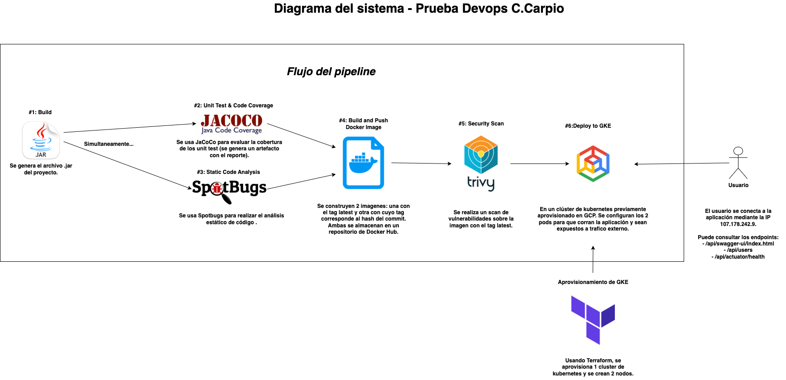

# Prueba Practica Devsu Devops - Christian Carpio

Este documento detalla el proceso llevado a cabo para desplegar la aplicacion **devsu-demo-devops-java** en GCP por medio de un pipeline de Gihthub Actions. 

## Diagrama del Despliegue

## Tecnologias empleadas
- Docker
- Jacoco
- SpotBugs
- Trivy
- Terraform (IaC)
- Google Cloud Platform / GCP (Proveedor de cloud computing)
- Google Kubernetes Engine / GKE (Servicio)
- Kubernetes (k8)

## 1. Modificaciones al proyecto base
Se agrego la dependencia *spring-boot-starter-actuator* y los plugins *spotbugs-maven-plugin* y *jacobo-maven-plugin*. Esto se realizo con el objetivo de exponer el endpoint */api/actuator/health* (para el healthcheck del dockerfile) y realizar las validaciones de covertura de codigo y analisis de codigo estatico respectivamente. 

Adicionalmente, se modifico el archivo *application.properties* y se agrego:

- management.endpoints.web.exposure.include=health,info 
- management.endpoint.health.show-details=always

Con la finalidad de exponer correctamente el endpoint para el mencionado healthcheck.

## 2. Creación del dockerfile
Se separo el dockerfile en 2 stages: Compilacion y Ejecucion

Durante la primera fase, se descargan las depencias definidas en el archivo pom y se compila el proyecto sin realizar los unit test (estos se realizan durante la ejecucion del pipeline).

En la segunda fase, se crean tanto un usuario como un grupo dedicado para poder ejecutar la aplicacion sin tener permisos de root user. Luego, se copia el archivo .jar resultante de la fase anterior, se expone el puerto 8000 y se configuran las variables de entorno. 

Posteriormente, se realiza el healthcheck usando el endpoint /api/actuator/health para comprobar el correcto funcionamiento del contenedor y realizar un reinicio automatico en caso de ser necesario.

En cuanto a los comandos que usados cuando arranca el contenedor, se habilito *java*, *-jar* y *app.jar*. 

Finalmente, se agregaron labels con la informacion del maintainer, version y nombre de aplicacion.

## 3. Aprovisionamiento de GKE con Terraform en GCP
Por medio de terraform, se aprovisono un cluster de GKE usando los archivos
- main.tf : Define el cluster y una custom pool de nodos a crearse en GCP
- outputs.tf : Regresa informacion para identificar el cluster como nombre y ubicacion
- provider : Define la informacion del provider a emplear (GCP), el nombre del proyecto y region donde se va a desplegar el cluster

Con esta estructura, se crea un cluster bajo el nombre *devsu-demo-devops-cluster* en la zona *us-central1-a*. Una vez creado, se elimina el nodo creado por defecto y se crean 2 nodos para soportar la carga de trabajo deseada. Estos nodos usan una maquina tipo *e2-medium* para estar por debajo de los limites del plan de prueba gratuito de GCP. 

Adicionalmente, se habiliaron las opciones *auto_repair* y *auto_upgrade* para tener tolerancia a fallos y actualizaciones. 

Se decidio no incluir el aprovisionamiento de esta estructura en el pipeline ya que:
- No es necesario realizar reaprovisionamientos frecuentes en este escenario, la infraestructura es constante
- Su inclusión incrementaria considerablemente el tiempo de ejecución del pipeline

## 4. Creación del pipeline
Usando Github Actions, se creo un pipeline que abarca desde la compilacion del proyecto hasta el despliegue de los contenedores en GKE

### Jobs creados
- Build
- Unit Test & Code Coverage
- Static Code Analysis
- Build and Push Docker Image
- Security Scan
- Deploy to GKE
